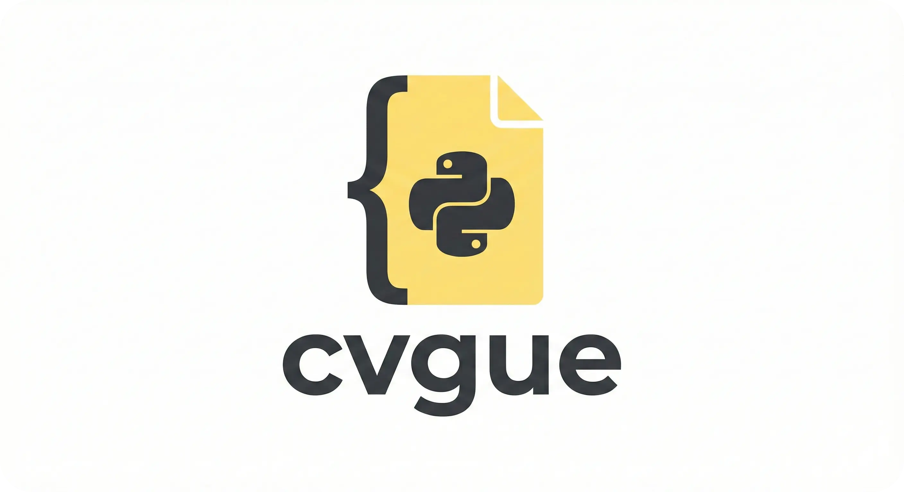
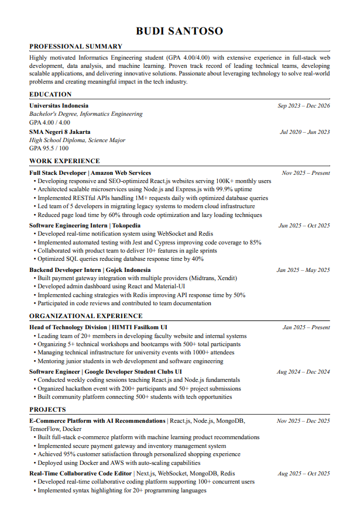
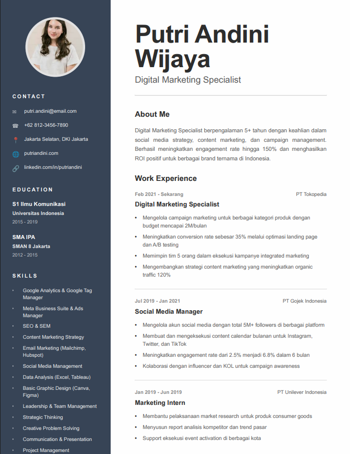

<div align="center">
  
  
  [](https://badge.fury.io/py/cvgue)
  [](https://pypi.org/project/cvgue/)
  [](https://opensource.org/licenses/MIT)
  [](https://pepy.tech/project/cvgue)
  [](https://github.com/AryaWiratama26/cvgue/stargazers)
  [](https://github.com/AryaWiratama26/cvgue/issues)
  
</div>


### Why the name CVGue?
CVGue is a portmanteau of "Curriculum Vitae" and "me" in Indonesian slang.


### Installation

```bash
pip install cvgue
```

### Available Templates

| Template | Description |
| --- | --- |
| ATS | ATS-friendly CV template (optimized for applicant tracking systems) |
| Creative | Creative CV template (modern & visually expressive) |


### Usage

#### Creative Template Usage
```python
from cvgue import create_cv


# Your Data
data = {
    "name": "your_name",
    "title": "your_title",
    "email": "your_email",
    "phone": "your_phone",
    "location": "your_location",
    "website": "your_website",
    "linkedin": "your_linkedin",
    "photo": "path_to_your_photo",
    
    "summary": "your_summary",
    
    "education": [
        {
            "degree": "your_degree",
            "institution": "your_institution",
            "period": "your_period",
            "location": "your_location",
            "gpa": "your_gpa"
        },
        {
            "degree": "your_degree",
            "institution": "your_institution",
            "period": "your_period",
            "location": "your_location",
            "gpa": "your_gpa"
        }
    ],
    
    "experience": [
        {
            "role": "your_role",
            "company": "your_company",
            "location": "your_location",
            "period": "your_period",
            "points": [
                "your_points",
                "your_points",
                "your_points",
                "your_points"
            ]
        },
        {
            "role": "your_role",
            "company": "your_company",
            "location": "your_location",
            "period": "your_period",
            "points": [
                "your_points",
                "your_points"
            ]
        },
        {
            "role": "your_role",
            "company": "your_company",
            "location": "your_location",
            "period": "your_period",
            "points": [
                "your_points"
            ]
        }
    ],
    
    "skills": {
        "hard": [
            "your_skills",
            "your_skills",
            "your_skills"
        ],
        "soft": [
            "your_skills",
            "your_skills",
            "your_skills"
        ]
    },
    
    "certifications": [
        "your_certifications",
        "your_certifications",
        "your_certifications"
    ],
    
    "languages": [
        "your_languages",
        "your_languages"
    ],
    
    "references": [
        {
            "name": "reference_name",
            "company": "reference_company",
            "position": "reference_position",
            "phone": "reference_phone",
            "email": "reference_email"
        },
        {
            "name": "reference_name",
            "company": "reference_company",
            "position": "reference_position",
            "phone": "reference_phone",
            "email": "reference_email"
        }
    ]
}

# Generate creative CV
create_cv(data, template_type="creative", output_path="cv_yourname_creative.pdf")

```

#### ATS Template Usage

```python
from cvgue import create_cv

# Your Data

data = {

    "name": "your_name",
    "location": "your_location",
    "phone": "your_phone",
    "email": "your_email",
    "linkedin": "your_linkedin",
    "website": "your_website",

    "summary": "your_summary",

    "education": [
        {
            "institution": "your_institution",
            "degree": "your_degree",
            "gpa": "your_gpa",
            "period": "your_period"
        }
    ],

    "experience": [
        {
            "role": "your_role",
            "company": "your_company",
            "period": "your_period",
            "points": [
                "your_points",
                "your_points"
            ]
        }
    ],

    "organizations": [
        {
            "role": "your_role",
            "organization": "your_organization",
            "period": "your_period",
            "points": [
                "your_points",
                "your_points"
            ]
        }
    ],

    "projects": [
        {
            "title": "your_project_title",
            "stack": "your_stack",
            "date": "your_date",
            "points": [
                "your_points",
                "your_points"
            ]
        },
        
    ],

    "skills": {
        "hard": ["your_skills"],
        "soft": ["your_skills"]
    },

    "certifications": [
        "your_certifications",
        "your_certifications",
        "your_certifications"
    ],

    "languages": [
        "your_language",
        "your_language"
    ]
}

# Generate ATS CV
create_cv(data, template_type="ats", output_path="cv_yourname_ats.pdf")
```

### Example Output

<div align="center">

| ATS Template | Creative Template |
|:---:|:---:|
| [Example ATS Template](/example/cv_budisantoso.pdf) | [Example Creative Template](/example/cv_putri_creative.pdf) |
|  |  |
| *Clean & ATS-friendly CV optimized for applicant tracking systems* | *Modern & visually expressive CV with sidebar layout* |

</div>


### Contributing

We welcome contributions! Please see our [Contributing Guide](CONTRIBUTING.md) for details on:

- Setting up the development environment
- Running tests
- Code style guidelines
- Submitting pull requests

Feel free to submit a pull request or open an issue if you find any bugs or have suggestions for new features.

### License

This project is licensed under the MIT License - see the [LICENSE](LICENSE) file for details.

